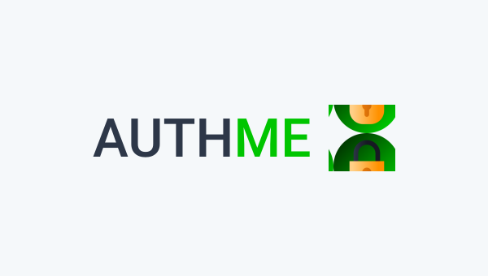

<h1 align="center">
    
</h1>

<h2 align="center">

[](https://github.com/pauloreis7/authme/issues)
[](https://github.com/pauloreis7/authme)
[](https://github.com/pauloreis7/authme/commits)
[](https://github.com/pauloreis7/authme/stargazers)
[](https://github.com/pauloreis7/authme/blob/master/LICENSE)
	
</h2>

<h1 align="center">
    
</h1>

<h4 align="center">🏁 Application already finished 🏁</h4>

<p align="center">🔐 Application to implement JWT token-based authentication 🔑</p>

## 🔗 Index
---
 <p>👉 <a href="#about">About the project</a> </p>
 <p>👉 <a href="#layout">Application Layout</a> </p>
 <p>👉 <a href="#func">Features</a> </p>
 <p>👉 <a href="#techs">Technologies</a> </p>
 <p>👉 <a href="#requests">Project Prerequisites</a> </p>
 <p>👉 <a href="#work">Download and execution</a> </p>
 <p>👉 <a href="#contribute">Contribute with the project</a> </p>
 <p>👉 <a href="#author">Author</a> </p>
 <p>👉 <a href="#license">License</a> </p>

<a id="about"></a>
## 🔎 About the project
---
<p>Full application for react authentication with JWT token.</p>

<a id="func"></a>
## ✅ Features
---
- [x] User Session System
- [x] Broadcast channel
- [x] JWT token authentication 
- [x] Refresh Token
- [x] Client and server side auth redirect
- [x] User authorization system for permissions and roles 

<a id="techs"></a>
## 🧪 Technologies
---
### 💻 Project developed with the following technologies

- [TypeScript](https://www.typescriptlang.org/)
- [React](https://reactjs.org/)
- [Next](https://nextjs.org/)
- [JWT](https://jwt.io/)
- [Sass](https://sass-lang.com/)

<a id="requests"></a>
## 🚨 Project Prerequisites
---
 Before you start, you will need to have the following tools installed on your machine:

* [Git](https://git-scm.com)
* [Yarn](https://yarnpkg.com/)

💡 Also, it is good to have an editor to work with the code like [VSCode](https://code.visualstudio.com/)

<a id="work"></a>
## 🏄‍♂️ Download and execution
---

````bash

# Clone the repository
$ git clone <https://github.com/pauloreis7/authme>

# Access the project folder terminal/cmd
$ cd authme

# Open project in VsCode
$ code .

# Install the project dependencies
yarn install

# Install and start the server to launch the app

# Run the application
$ yarn dev or build

# The app will start on port:3000 
access  <http://localhost:3000>

````

<a id="contribute"></a>
## 🎉 How Contribute

[](https://github.com/pauloreis7/authme/pulls)

---

<b>1. Fork the project.</b> <br />
<b>2. Create a new branch with your changes: git 3. checkout -b my-feature</b> <br />
<b>3. Save your changes and create a commit message telling what you have done: git commit -m "feature: My new feature</b> <br />
<b>4. Submit your changes: git push origin my-feature</b>


<a id="author"></a>
## Author
---

## 👨‍💻 Author

<a href="https://github.com/pauloreis7">


<b>Paulo Reis</b> 🏆 

</a>

<p>Made by Paulo Reis 🤴 Contact us 👋</p>

<a href = "mailto:paulosilvadosreis2057@gmail.com"></a>
<a href="https://www.linkedin.com/in/paulo-reis7/" target="_blank"></a>
<a href="https://www.instagram.com/pauloreis.7" target="_blank"></a>

<a id="license"></a>
## 📝 License
---
This project is under the MIT license. See the [LICENSE](LICENSE) file for more details.🏛️
